<center>

# GIT-WORK


</center>

***Nombre:*** Jessica Dóniz Linares, David Gutiérrez Gutiérrez </br>
***Curso:*** 2º de Ciclo Superior de Desarrollo de Aplicaciones Web.

### ÍNDICE

+ [Introducción](#id1)
+ [Objetivos](#id2)
+ [Material empleado](#id3)
+ [Desarrollo](#id4)
+ [Conclusión](#id5)


### ***Introducción***. <a name="id1"></a>

En la siguiente práctica trabajaremos con documentación y el sistema de control de versiones de github. </br>
</br>El sistema de control de versiones nos permite llevar un seguimiento de los cambios realizados, no solo eso, sino que también te ofrece la posibilidad de volver a versiones anteriores. Este sistema te permite trabajar de manera simultánea con diferentes colaboradores, pudiendo contrastar las diferentes versiones de los usuarios.


### ***Objetivos***. <a name="id2"></a>

Los objetivos a realizar son:

+ Crear un repositorio.
+ Clonar el repositorio en local.
+ Crear ramas y moverse entre ellas.
+ Crear issues y solucionarlas.
+ Modificar los archivos y subirlos.
+ Hacer y revisar los pull request antes del merge.
+ Arreglar conflictos entre diferentes ramas.

### ***Material empleado***. <a name="id3"></a>

Para realizar esta actividad hemos empleado:

*Hardware*
+ Ordenadores de clase.
+ Ordenadores de casa.

*Software*
+ Github.
+ Máquina virtual (Debian).

### ***Desarrollo***. <a name="id4"></a>

***user1:*** David Gutiérrez Gutiérrez </br>
***user2:*** Jessica Dóniz Linares

#### 1. user1 creará un repositorio público llamado git-work en su cuenta de GitHub, añadiendo un README.md y una licencia MIT.
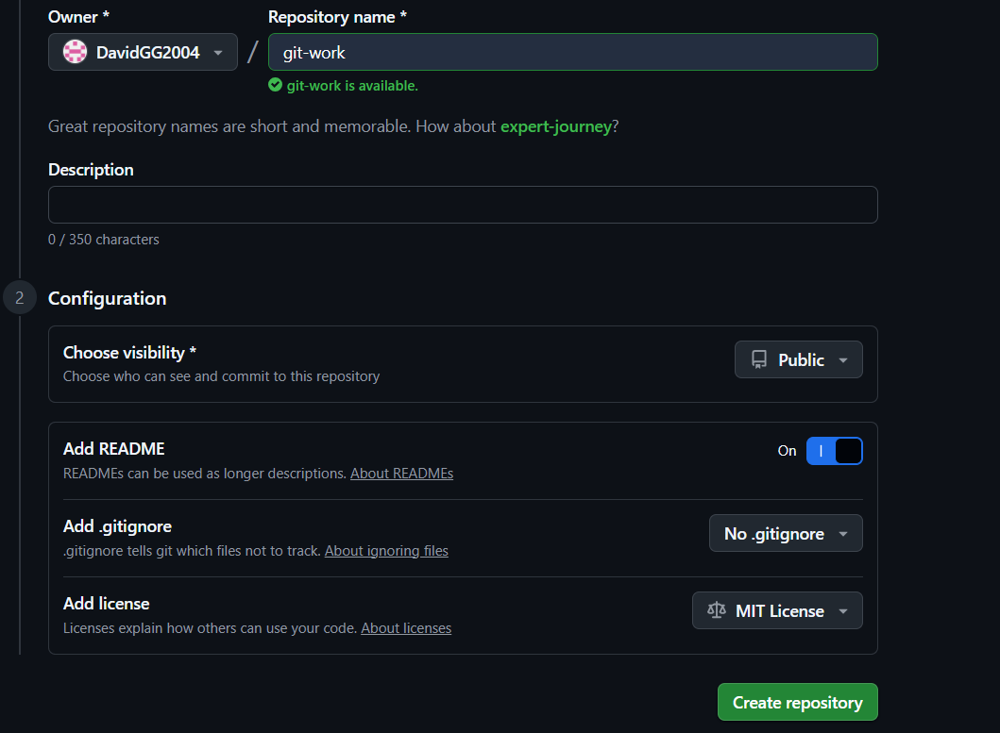
   - Creamos el repositorio git-work desde el github con el README.md y con la licencia MIT.

#### 2. user1 clonará el repo y añadirá los ficheros: index.html, bootstrap.min.css y cover.css. Luego subirá los cambios al upstream. 

   - user1 clona el repositorio. -> `git clone https://github.com/DavidGG2004/git-work.git`.</br>
  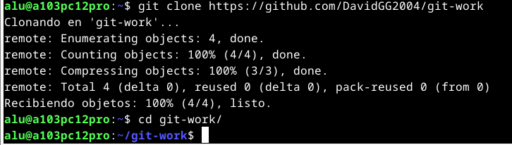
  - Sube los cambios al upstream. --> </br>
  
  ```
   git add .
   git commit -m "Add index.html, boostrap.min.css and cover.css"
   git push origin main
   ```
  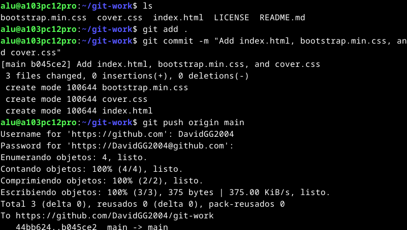

#### 3. user2 creará un fork de git-work desde su cuenta de GitHub. user2 clonará su fork del repo.

   - user2 clona el fork del repositorio git-work. --> `git clone https://github.com/Jessicad-l/git-work.git`.</br>
  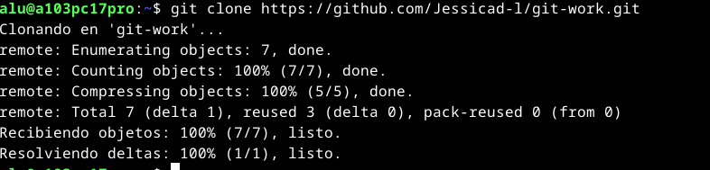

#### 4. user1 creará una issue con el título "Add custom text for startup contents".
   - Crea una issue --> </br>
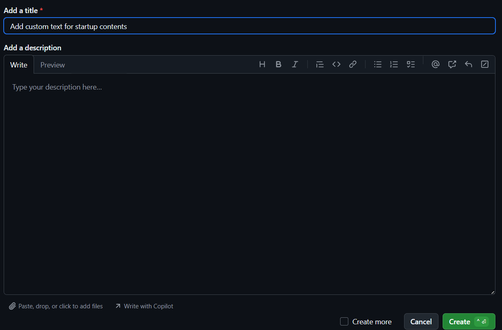

#### 5. user2 creará una nueva rama custom-text y modificará el fichero index.html personalizándolo para una supuesta startup.

   - user2 crea la rama custom-text y se mueve hacia ella para modificar el index.html. --> `git checkout -b custom-text`.
   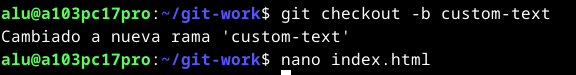
   - Modifica el fichero index.html y commitea los cambios. --> 
   ```
   nano index.html
   git add index.html
   git commit -m "Starting index.html startup project"
   git push origin custom-text
   ```
   </br>
   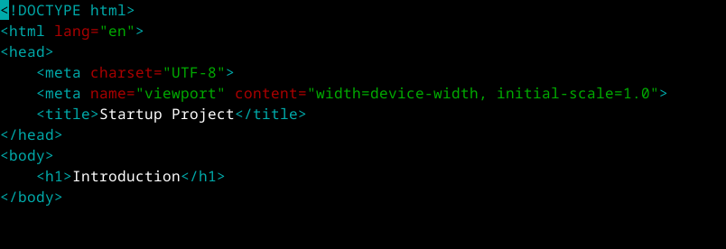
   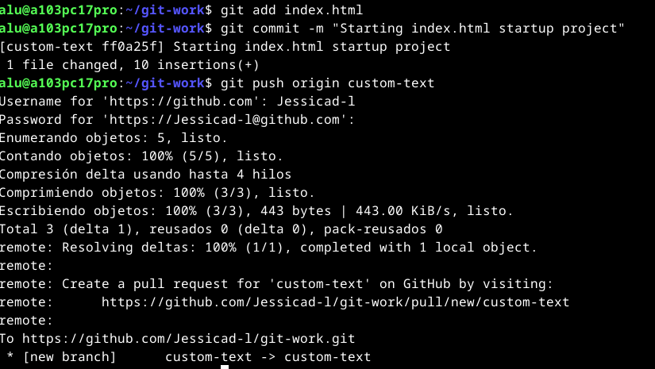
   
#### 6. user2 enviará un PR a user1. 

   - Envía un pull request con los cambios realizados --> </br>
     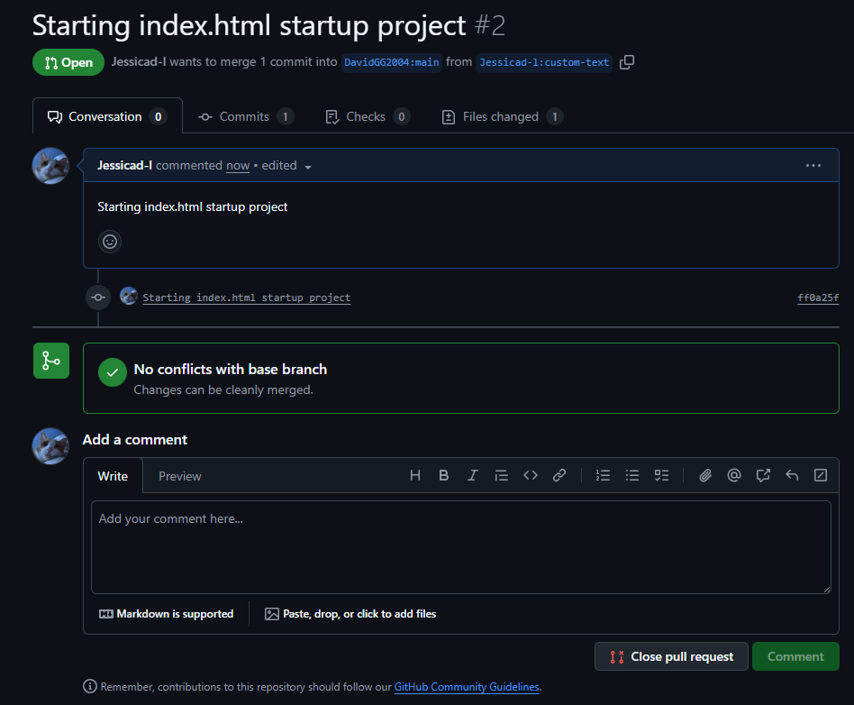
   
#### 7. user1 probará el PR de user2 en su máquina (copia local) creando previamente un remoto denominado upstream, y realizará ciertos cambios en su copia local que luego deberá subir al propio PR.

   - user1 prueba el pull request creando upstream --> 
   ```
   git remote add upstream https://github.com/Jessicad-l/git-work.git
   git fetch upstream
   git checkout -b custom-text upstream/custom-text
   ```
  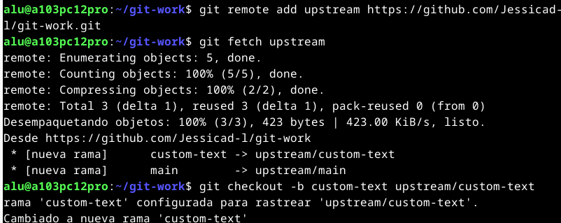
  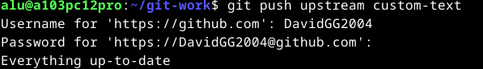
  
#### 8. user1 y user2 tendrán una pequeña conversación en la página del PR, donde cada usuario incluirá, al menos, un cambio más.
   - Ambos users implementan cambios -->
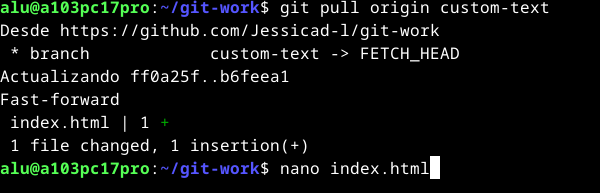
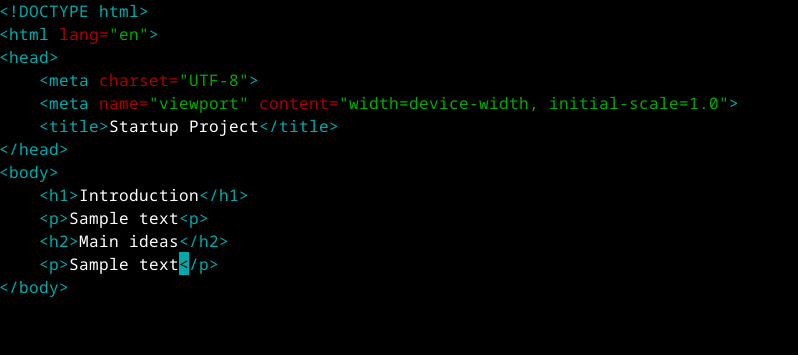
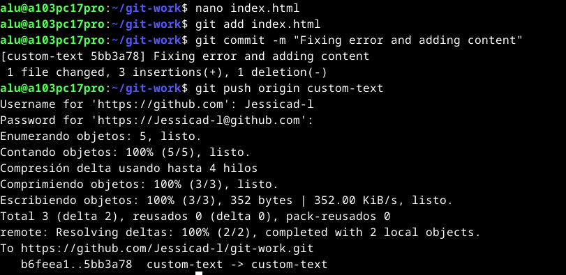
   - Se llega a un acuerdo manteniendo una conversación antes de realizar el PR -->
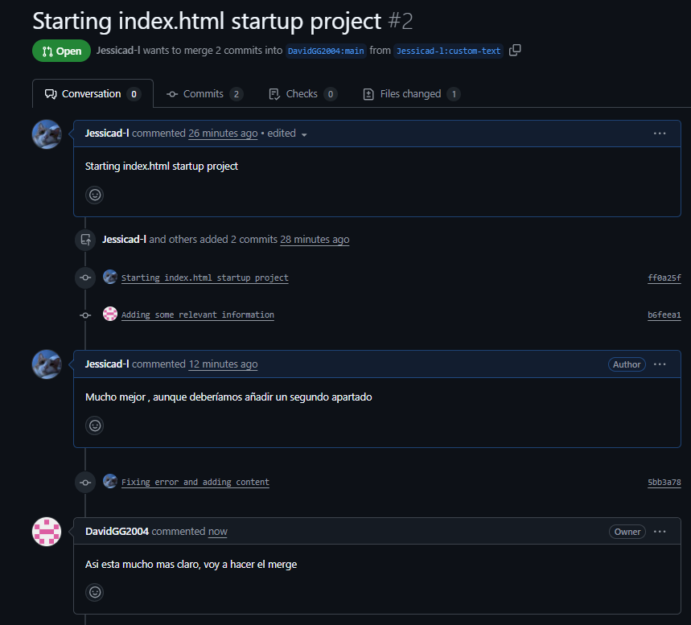


#### 9. user1 finalmente aprobará el PR, cerrará la issue creada (usando una referencia a la misma) y actualizará la rama principal en su copia local.
   - Se aprueba el PR -->

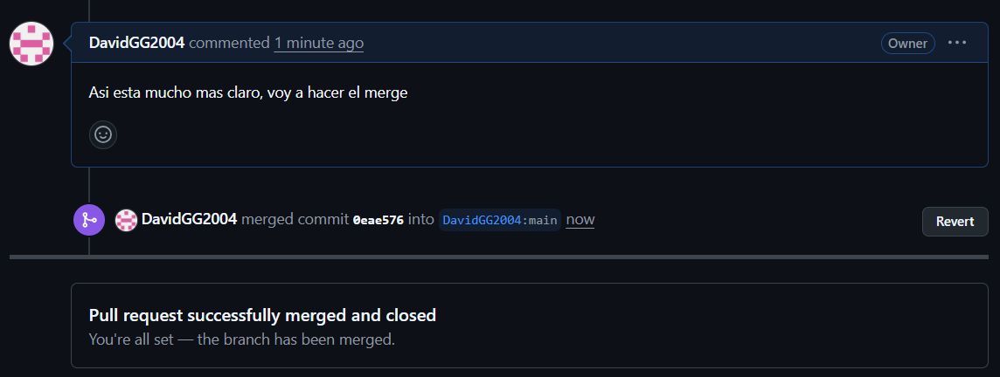
   - Cerramos la issue "Add custom text for startup contents" -->
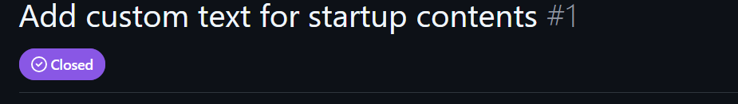

#### 10. user2 deberá incorporar los cambios de la rama principal de upstream en su propia rama principal.
   - Incorpora los cambios a su propia rama, se mueve a la rama principal y hace un merge y por último sube los cambios-->
```
   git remote add upstream hhtps://github.com/DavidGG2004/git-work.git
   git fetch upstream
   git checkout main
   git merge upstream/main
   git push origin main
```
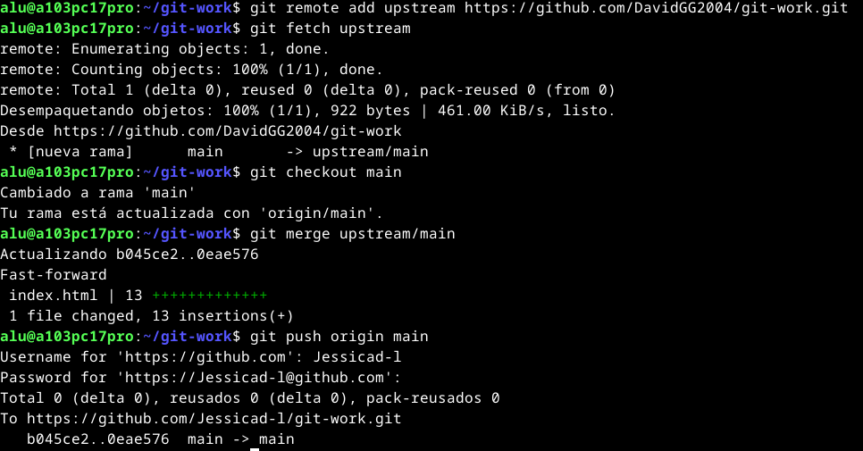


#### 11. user1 creará una issue con el título "Improve UX with cool colors".

   - Crea el issue "Improve UX with cool colors" -->
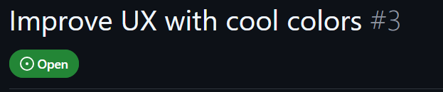

#### 12. user1 cambiará la línea 10 de cover.css a: color: purple;

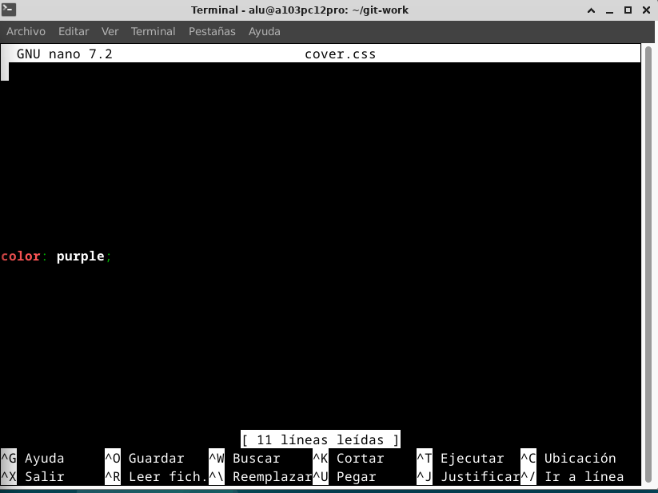

#### 13. user1 hará simplemente un commit local en main → NO HACER git push.
   - Se realizan cambios en el cover.css y se commitean -->
```
   nano cover.css
   git add cover.css
   git commit -m "Change text color to purple"
```

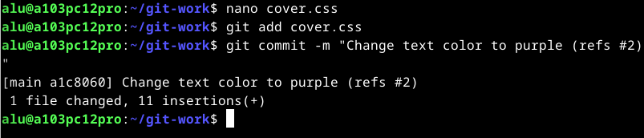

#### 14. user2 creará una nueva rama cool-colors y cambiará la línea 10 de cover.css a: color: darkgreen;
   - Crea una nueva rama y se mueve hacia ella --> `git checkout -b cool-colors`
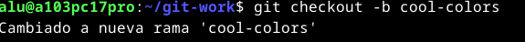
   - Se añaden los cambios de cover.css -->
```
   git add cover.css
   git commit -m "Color to darkgreen"
   git push origin main
```
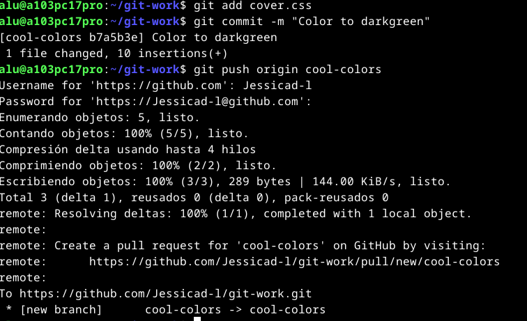

#### 15. user2 enviará un PR a user1.

Enviamos desde github un pull request.

#### 16. user1 probará el PR de user2 (en su copia local). A continuación tratará de mergear el contenido de la rama cool-colors en su rama principal y tendrá que gestionar el conflicto: Dejar el contenido que viene de user2.
   - Hace merge del contenido de cool-colors generando conflicto -->
```
   git fetch upstream
   git checkout -b cool-colors upstream/cool-colors
   git checkout main
   git merge cool-colors
```
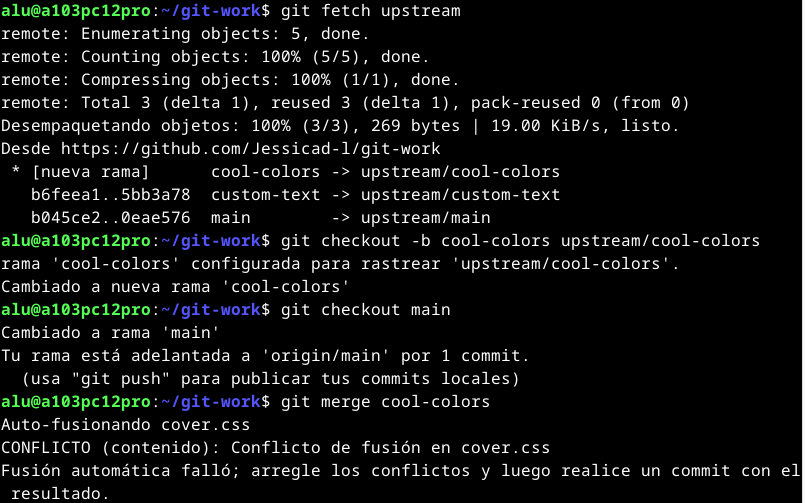
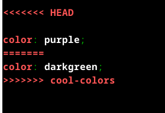


#### 17. Después del commit para arreglar el conflicto, user1 modificará la línea 11 de cover.css a: text-shadow: 2px 2px 8px lightgreen;

 `nano cover.css`
 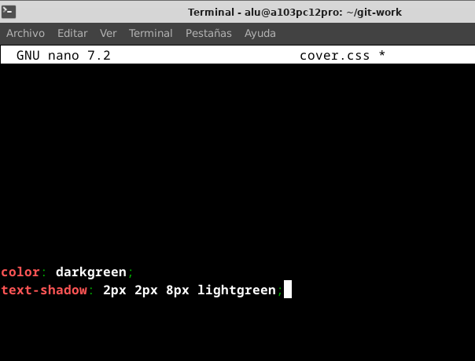

#### 18. user1 hará un commit especificando en el mensaje de commit el cambio hecho (sombra) y que se cierra la issue creada (usar referencia a la issue). A continuación subirá los cambios a origin/main.

   - Se añaden los cambios y la resolución del conflicto. -->
```
   git add cover.css
   git commit -m "Resolve conflict with darkgreen, adding text shadow"
   git push origin main
```

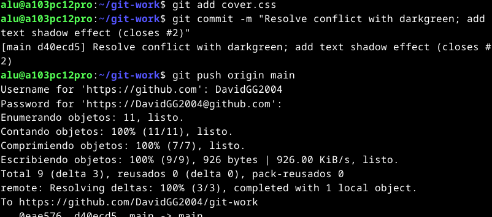
- Cierra la issue "Improve UX with colors". -->
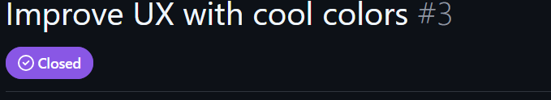

#### 19. user1 etiquetará esta versión (en su copia local) como 0.1.0 y después de subir los cambios creará una "release" en GitHub apuntando a esta etiqueta.

   - Etiqueta la versión 0.1.0 -->
```
   git tag -a v0.1.0 -m "Release version 0.1.0"
   git push origin v0.1.0
```
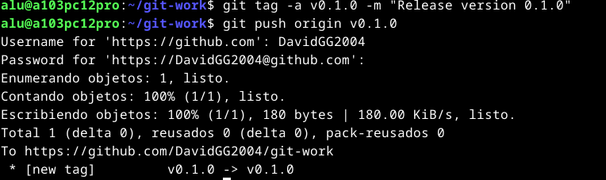
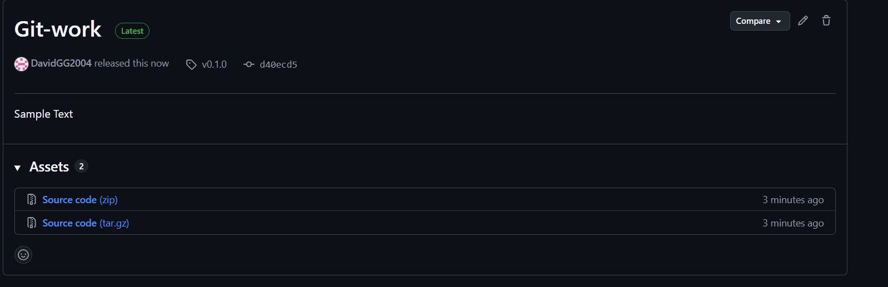

### ***Conclusión***. <a name="id5"></a>

Hemos realizado esta práctica donde pudimos practicar con el sistema de control de versiones. Se ha creado un repositorio, ramas, issues, pull request y se han resuelto conflictos creados. <br/>
Este proyecto sin duda nos ha ayudado a recordar el funcionamiento del sistema de control de versiones y su gran utilidad para trabajar en un proyecto de manera simultánea
